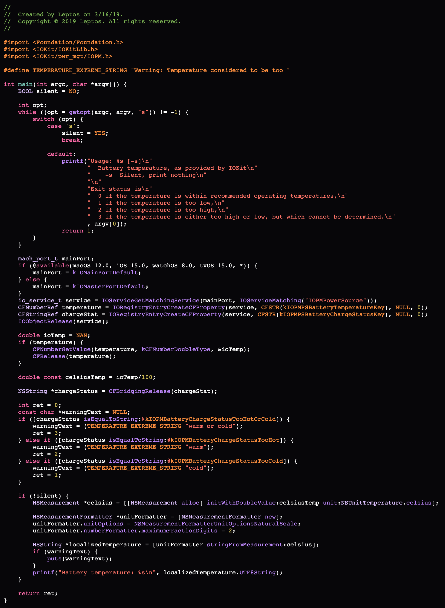

## LspHighlight

LspHighlight is a command line tool designed to act as an LSP client to output a source code file in HTML format with semantic tokens annotated using CSS classes.


### Usage

```
USAGE: lsp-highlight --lsp-server <path> [-Xlsp <flag> ...] [--language <language>] <file-path>

ARGUMENTS:
  <file-path>             Path to the source code file

OPTIONS:
  -S, --lsp-server <path> Path to the LSP server
  -Xlsp <flag>            Pass flag to the LSP server
  --language <language>   The LSP language identifier for the given source code file
        By default, the program attempts to select the language based on the file name
  -h, --help              Show help information.
```

`lsp-highlight` uses <https://github.com/apple/swift-argument-parser>, which automatically provides shell completion scripts.
Pass `--generate-completion-script` to `lsp-highlight` to generate the completion script for your shell.

```
use --generate-completion-script=<shell> with one of:
    zsh bash fish
```

For more information, see https://apple.github.io/swift-argument-parser/documentation/argumentparser/installingcompletionscripts


### Sample

This section demonstrates how `lsp-highlight` may be used.

We have the code snippet below in a file named `main.m`.

<details>

<summary>Input source code</summary>

(This file is based off of <https://github.com/leptos-null/iobat/blob/5a2e6719d7ab503612cc0654670bd50c1562fa2e/src/main.m>)

```objc
//
//  Created by Leptos on 3/16/19.
//  Copyright © 2019 Leptos. All rights reserved.
//

#import <Foundation/Foundation.h>
#import <IOKit/IOKitLib.h>
#import <IOKit/pwr_mgt/IOPM.h>

#define TEMPERATURE_EXTREME_STRING "Warning: Temperature considered to be too "

int main(int argc, char *argv[]) {
    BOOL silent = NO;
    
    int opt;
    while ((opt = getopt(argc, argv, "s")) != -1) {
        switch (opt) {
            case 's':
                silent = YES;
                break;
                
            default:
                printf("Usage: %s [-s]\n"
                       "  Battery temperature, as provided by IOKit\n"
                       "    -s  Silent, print nothing\n"
                       "\n"
                       "Exit status is\n"
                       "  0 if the temperature is within recommended operating temperatures,\n"
                       "  1 if the temperature is too low,\n"
                       "  2 if the temperature is too high,\n"
                       "  3 if the temperature is either too high or low, but which cannot be determined.\n"
                       , argv[0]);
                return 1;
        }
    }
    
    mach_port_t mainPort;
    if (@available(macOS 12.0, iOS 15.0, watchOS 8.0, tvOS 15.0, *)) {
        mainPort = kIOMainPortDefault;
    } else {
        mainPort = kIOMasterPortDefault;
    }
    io_service_t service = IOServiceGetMatchingService(mainPort, IOServiceMatching("IOPMPowerSource"));
    CFNumberRef temperature = IORegistryEntryCreateCFProperty(service, CFSTR(kIOPMPSBatteryTemperatureKey), NULL, 0);
    CFStringRef chargeStat = IORegistryEntryCreateCFProperty(service, CFSTR(kIOPMPSBatteryChargeStatusKey), NULL, 0);
    IOObjectRelease(service);
    
    double ioTemp = NAN;
    if (temperature) {
        CFNumberGetValue(temperature, kCFNumberDoubleType, &ioTemp);
        CFRelease(temperature);
    }
    
    double const celsiusTemp = ioTemp/100;
    
    NSString *chargeStatus = CFBridgingRelease(chargeStat);
    
    int ret = 0;
    const char *warningText = NULL;
    if ([chargeStatus isEqualToString:@kIOPMBatteryChargeStatusTooHotOrCold]) {
        warningText = (TEMPERATURE_EXTREME_STRING "warm or cold");
        ret = 3;
    } else if ([chargeStatus isEqualToString:@kIOPMBatteryChargeStatusTooHot]) {
        warningText = (TEMPERATURE_EXTREME_STRING "warm");
        ret = 2;
    } else if ([chargeStatus isEqualToString:@kIOPMBatteryChargeStatusTooCold]) {
        warningText = (TEMPERATURE_EXTREME_STRING "cold");
        ret = 1;
    }
    
    if (!silent) {
        NSMeasurement *celsius = [[NSMeasurement alloc] initWithDoubleValue:celsiusTemp unit:NSUnitTemperature.celsius];
        
        NSMeasurementFormatter *unitFormatter = [NSMeasurementFormatter new];
        unitFormatter.unitOptions = NSMeasurementFormatterUnitOptionsNaturalScale;
        unitFormatter.numberFormatter.maximumFractionDigits = 2;
        
        NSString *localizedTemperature = [unitFormatter stringFromMeasurement:celsius];
        if (warningText) {
            puts(warningText);
        }
        printf("Battery temperature: %s\n", localizedTemperature.UTF8String);
    }
    
    return ret;
}
```

</details>


We then run `lsp-highlight -S $(xcrun -f clangd) main.m` to produce the following HTML output:

<details>

<summary>HTML output</summary>

```html
<span class="lsp-type-comment">//</span>
<span class="lsp-type-comment">//  Created by Leptos on 3/16/19.</span>
<span class="lsp-type-comment">//  Copyright © 2019 Leptos. All rights reserved.</span>
<span class="lsp-type-comment">//</span>

<span class="lsp-type-macro">#</span><span class="lsp-type-macro">import</span> <span class="lsp-type-macro">&lt;</span><span class="lsp-type-macro">Foundation</span><span class="lsp-type-macro">/</span><span class="lsp-type-macro">Foundation</span><span class="lsp-type-macro">.</span><span class="lsp-type-macro">h</span><span class="lsp-type-macro">&gt;</span>
<span class="lsp-type-macro">#</span><span class="lsp-type-macro">import</span> <span class="lsp-type-macro">&lt;</span><span class="lsp-type-macro">IOKit</span><span class="lsp-type-macro">/</span><span class="lsp-type-macro">IOKitLib</span><span class="lsp-type-macro">.</span><span class="lsp-type-macro">h</span><span class="lsp-type-macro">&gt;</span>
<span class="lsp-type-macro">#</span><span class="lsp-type-macro">import</span> <span class="lsp-type-macro">&lt;</span><span class="lsp-type-macro">IOKit</span><span class="lsp-type-macro">/</span><span class="lsp-type-macro">pwr_mgt</span><span class="lsp-type-macro">/</span><span class="lsp-type-macro">IOPM</span><span class="lsp-type-macro">.</span><span class="lsp-type-macro">h</span><span class="lsp-type-macro">&gt;</span>

<span class="lsp-type-macro">#</span><span class="lsp-type-macro">define</span> <span class="lsp-type-macro lsp-modifier-declaration lsp-modifier-globalScope">TEMPERATURE_EXTREME_STRING</span> <span class="lsp-type-macro">&quot;Warning: Temperature considered to be too &quot;</span>

<span class="lsp-type-keyword">int</span> <span class="lsp-type-function lsp-modifier-declaration lsp-modifier-globalScope">main</span>(<span class="lsp-type-keyword">int</span> <span class="lsp-type-parameter lsp-modifier-declaration lsp-modifier-functionScope">argc</span>, <span class="lsp-type-keyword">char</span> *<span class="lsp-type-parameter lsp-modifier-functionScope lsp-modifier-declaration">argv</span>[]) {
    <span class="lsp-type-type lsp-modifier-fileScope lsp-modifier-defaultLibrary">BOOL</span> <span class="lsp-type-variable lsp-modifier-declaration lsp-modifier-functionScope">silent</span> = <span class="lsp-type-macro lsp-modifier-globalScope">NO</span>;
    
    <span class="lsp-type-keyword">int</span> <span class="lsp-type-variable lsp-modifier-functionScope lsp-modifier-declaration">opt</span>;
    <span class="lsp-type-keyword">while</span> ((<span class="lsp-type-variable lsp-modifier-functionScope">opt</span> <span class="lsp-type-operator">=</span> <span class="lsp-type-function lsp-modifier-defaultLibrary lsp-modifier-globalScope">getopt</span>(<span class="lsp-type-parameter lsp-modifier-functionScope">argc</span>, <span class="lsp-type-parameter lsp-modifier-functionScope">argv</span>, <span class="lsp-type-string">&quot;s&quot;</span>)) <span class="lsp-type-operator">!=</span> <span class="lsp-type-operator">-</span><span class="lsp-type-number">1</span>) {
        <span class="lsp-type-keyword">switch</span> (<span class="lsp-type-variable lsp-modifier-functionScope">opt</span>) {
            <span class="lsp-type-keyword">case</span> <span class="lsp-type-number">&apos;s&apos;</span>:
                <span class="lsp-type-variable lsp-modifier-functionScope">silent</span> <span class="lsp-type-operator">=</span> <span class="lsp-type-macro lsp-modifier-globalScope">YES</span>;
                <span class="lsp-type-keyword">break</span>;
                
            <span class="lsp-type-keyword">default</span>:
                <span class="lsp-type-function lsp-modifier-defaultLibrary lsp-modifier-globalScope">printf</span>(<span class="lsp-type-string">&quot;Usage: %s [-s]\n&quot;</span>
                       <span class="lsp-type-string">&quot;  Battery temperature, as provided by IOKit\n&quot;</span>
                       <span class="lsp-type-string">&quot;    -s  Silent, print nothing\n&quot;</span>
                       <span class="lsp-type-string">&quot;\n&quot;</span>
                       <span class="lsp-type-string">&quot;Exit status is\n&quot;</span>
                       <span class="lsp-type-string">&quot;  0 if the temperature is within recommended operating temperatures,\n&quot;</span>
                       <span class="lsp-type-string">&quot;  1 if the temperature is too low,\n&quot;</span>
                       <span class="lsp-type-string">&quot;  2 if the temperature is too high,\n&quot;</span>
                       <span class="lsp-type-string">&quot;  3 if the temperature is either too high or low, but which cannot be determined.\n&quot;</span>
                       , <span class="lsp-type-parameter lsp-modifier-functionScope">argv</span>[<span class="lsp-type-number">0</span>]);
                <span class="lsp-type-keyword">return</span> <span class="lsp-type-number">1</span>;
        }
    }
    
    <span class="lsp-type-type lsp-modifier-defaultLibrary lsp-modifier-fileScope">mach_port_t</span> <span class="lsp-type-variable lsp-modifier-declaration lsp-modifier-functionScope">mainPort</span>;
    <span class="lsp-type-keyword">if</span> (@<span class="lsp-type-keyword">available</span>(macOS 12.0, iOS 15.0, watchOS 8.0, tvOS 15.0, *)) {
        <span class="lsp-type-variable lsp-modifier-functionScope">mainPort</span> <span class="lsp-type-operator">=</span> <span class="lsp-type-variable lsp-modifier-defaultLibrary lsp-modifier-readonly lsp-modifier-globalScope">kIOMainPortDefault</span>;
    } <span class="lsp-type-keyword">else</span> {
        <span class="lsp-type-variable lsp-modifier-functionScope">mainPort</span> <span class="lsp-type-operator">=</span> <span class="lsp-type-variable lsp-modifier-readonly lsp-modifier-defaultLibrary lsp-modifier-globalScope">kIOMasterPortDefault</span>;
    }
    <span class="lsp-type-type lsp-modifier-defaultLibrary lsp-modifier-fileScope">io_service_t</span> <span class="lsp-type-variable lsp-modifier-functionScope lsp-modifier-declaration">service</span> = <span class="lsp-type-function lsp-modifier-defaultLibrary lsp-modifier-globalScope">IOServiceGetMatchingService</span>(<span class="lsp-type-variable lsp-modifier-functionScope">mainPort</span>, <span class="lsp-type-function lsp-modifier-defaultLibrary lsp-modifier-globalScope">IOServiceMatching</span>(<span class="lsp-type-string">&quot;IOPMPowerSource&quot;</span>));
    <span class="lsp-type-type lsp-modifier-fileScope lsp-modifier-defaultLibrary">CFNumberRef</span> <span class="lsp-type-variable lsp-modifier-readonly lsp-modifier-declaration lsp-modifier-functionScope">temperature</span> = <span class="lsp-type-function lsp-modifier-defaultLibrary lsp-modifier-globalScope">IORegistryEntryCreateCFProperty</span>(<span class="lsp-type-variable lsp-modifier-functionScope">service</span>, <span class="lsp-type-macro lsp-modifier-globalScope">CFSTR</span>(<span class="lsp-type-macro lsp-modifier-globalScope">kIOPMPSBatteryTemperatureKey</span>), <span class="lsp-type-macro lsp-modifier-globalScope">NULL</span>, <span class="lsp-type-number">0</span>);
    <span class="lsp-type-type lsp-modifier-defaultLibrary lsp-modifier-fileScope">CFStringRef</span> <span class="lsp-type-variable lsp-modifier-functionScope lsp-modifier-readonly lsp-modifier-declaration">chargeStat</span> = <span class="lsp-type-function lsp-modifier-globalScope lsp-modifier-defaultLibrary">IORegistryEntryCreateCFProperty</span>(<span class="lsp-type-variable lsp-modifier-functionScope">service</span>, <span class="lsp-type-macro lsp-modifier-globalScope">CFSTR</span>(<span class="lsp-type-macro lsp-modifier-globalScope">kIOPMPSBatteryChargeStatusKey</span>), <span class="lsp-type-macro lsp-modifier-globalScope">NULL</span>, <span class="lsp-type-number">0</span>);
    <span class="lsp-type-function lsp-modifier-defaultLibrary lsp-modifier-globalScope">IOObjectRelease</span>(<span class="lsp-type-variable lsp-modifier-functionScope">service</span>);
    
    <span class="lsp-type-keyword">double</span> <span class="lsp-type-variable lsp-modifier-functionScope lsp-modifier-declaration">ioTemp</span> = <span class="lsp-type-macro lsp-modifier-globalScope">NAN</span>;
    <span class="lsp-type-keyword">if</span> (<span class="lsp-type-variable lsp-modifier-functionScope lsp-modifier-readonly">temperature</span>) {
        <span class="lsp-type-function lsp-modifier-globalScope lsp-modifier-defaultLibrary">CFNumberGetValue</span>(<span class="lsp-type-variable lsp-modifier-functionScope lsp-modifier-readonly">temperature</span>, <span class="lsp-type-enumMember lsp-modifier-readonly lsp-modifier-fileScope lsp-modifier-defaultLibrary">kCFNumberDoubleType</span>, <span class="lsp-type-operator">&amp;</span><span class="lsp-type-variable lsp-modifier-functionScope">ioTemp</span>);
        <span class="lsp-type-function lsp-modifier-globalScope lsp-modifier-defaultLibrary">CFRelease</span>(<span class="lsp-type-variable lsp-modifier-readonly lsp-modifier-functionScope">temperature</span>);
    }
    
    <span class="lsp-type-keyword">double</span> <span class="lsp-type-keyword">const</span> <span class="lsp-type-variable lsp-modifier-functionScope lsp-modifier-declaration lsp-modifier-readonly">celsiusTemp</span> = <span class="lsp-type-variable lsp-modifier-functionScope">ioTemp</span><span class="lsp-type-operator">/</span><span class="lsp-type-number">100</span>;
    
    <span class="lsp-type-class lsp-modifier-globalScope lsp-modifier-defaultLibrary">NSString</span> *<span class="lsp-type-variable lsp-modifier-functionScope lsp-modifier-declaration">chargeStatus</span> = <span class="lsp-type-function lsp-modifier-fileScope lsp-modifier-defaultLibrary">CFBridgingRelease</span>(<span class="lsp-type-variable lsp-modifier-readonly lsp-modifier-functionScope">chargeStat</span>);
    
    <span class="lsp-type-keyword">int</span> <span class="lsp-type-variable lsp-modifier-functionScope lsp-modifier-declaration">ret</span> = <span class="lsp-type-number">0</span>;
    <span class="lsp-type-keyword">const</span> <span class="lsp-type-keyword">char</span> *<span class="lsp-type-variable lsp-modifier-functionScope lsp-modifier-declaration lsp-modifier-readonly">warningText</span> = <span class="lsp-type-macro lsp-modifier-globalScope">NULL</span>;
    <span class="lsp-type-keyword">if</span> ([<span class="lsp-type-variable lsp-modifier-functionScope">chargeStatus</span> <span class="lsp-type-method lsp-modifier-defaultLibrary lsp-modifier-classScope">isEqualToString</span>:<span class="lsp-type-string">@</span><span class="lsp-type-macro lsp-modifier-globalScope">kIOPMBatteryChargeStatusTooHotOrCold</span>]) {
        <span class="lsp-type-variable lsp-modifier-functionScope lsp-modifier-readonly">warningText</span> <span class="lsp-type-operator">=</span> (<span class="lsp-type-macro lsp-modifier-globalScope">TEMPERATURE_EXTREME_STRING</span> <span class="lsp-type-string">&quot;warm or cold&quot;</span>);
        <span class="lsp-type-variable lsp-modifier-functionScope">ret</span> <span class="lsp-type-operator">=</span> <span class="lsp-type-number">3</span>;
    } <span class="lsp-type-keyword">else</span> <span class="lsp-type-keyword">if</span> ([<span class="lsp-type-variable lsp-modifier-functionScope">chargeStatus</span> <span class="lsp-type-method lsp-modifier-defaultLibrary lsp-modifier-classScope">isEqualToString</span>:<span class="lsp-type-string">@</span><span class="lsp-type-macro lsp-modifier-globalScope">kIOPMBatteryChargeStatusTooHot</span>]) {
        <span class="lsp-type-variable lsp-modifier-readonly lsp-modifier-functionScope">warningText</span> <span class="lsp-type-operator">=</span> (<span class="lsp-type-macro lsp-modifier-globalScope">TEMPERATURE_EXTREME_STRING</span> <span class="lsp-type-string">&quot;warm&quot;</span>);
        <span class="lsp-type-variable lsp-modifier-functionScope">ret</span> <span class="lsp-type-operator">=</span> <span class="lsp-type-number">2</span>;
    } <span class="lsp-type-keyword">else</span> <span class="lsp-type-keyword">if</span> ([<span class="lsp-type-variable lsp-modifier-functionScope">chargeStatus</span> <span class="lsp-type-method lsp-modifier-classScope lsp-modifier-defaultLibrary">isEqualToString</span>:<span class="lsp-type-string">@</span><span class="lsp-type-macro lsp-modifier-globalScope">kIOPMBatteryChargeStatusTooCold</span>]) {
        <span class="lsp-type-variable lsp-modifier-functionScope lsp-modifier-readonly">warningText</span> <span class="lsp-type-operator">=</span> (<span class="lsp-type-macro lsp-modifier-globalScope">TEMPERATURE_EXTREME_STRING</span> <span class="lsp-type-string">&quot;cold&quot;</span>);
        <span class="lsp-type-variable lsp-modifier-functionScope">ret</span> <span class="lsp-type-operator">=</span> <span class="lsp-type-number">1</span>;
    }
    
    <span class="lsp-type-keyword">if</span> (<span class="lsp-type-operator">!</span><span class="lsp-type-variable lsp-modifier-functionScope">silent</span>) {
        <span class="lsp-type-class lsp-modifier-globalScope lsp-modifier-defaultLibrary">NSMeasurement</span> *<span class="lsp-type-variable lsp-modifier-functionScope lsp-modifier-declaration">celsius</span> = [[<span class="lsp-type-class lsp-modifier-globalScope lsp-modifier-defaultLibrary">NSMeasurement</span> <span class="lsp-type-function lsp-modifier-static lsp-modifier-classScope lsp-modifier-defaultLibrary">alloc</span>] <span class="lsp-type-method lsp-modifier-classScope lsp-modifier-defaultLibrary">initWithDoubleValue</span>:<span class="lsp-type-variable lsp-modifier-readonly lsp-modifier-functionScope">celsiusTemp</span> <span class="lsp-type-method lsp-modifier-defaultLibrary lsp-modifier-classScope">unit</span>:<span class="lsp-type-class lsp-modifier-defaultLibrary lsp-modifier-globalScope">NSUnitTemperature</span>.<span class="lsp-type-property lsp-modifier-defaultLibrary lsp-modifier-static lsp-modifier-classScope">celsius</span>];
        
        <span class="lsp-type-class lsp-modifier-defaultLibrary lsp-modifier-globalScope">NSMeasurementFormatter</span> *<span class="lsp-type-variable lsp-modifier-functionScope lsp-modifier-declaration">unitFormatter</span> = [<span class="lsp-type-class lsp-modifier-globalScope lsp-modifier-defaultLibrary">NSMeasurementFormatter</span> <span class="lsp-type-function lsp-modifier-defaultLibrary lsp-modifier-classScope lsp-modifier-static">new</span>];
        <span class="lsp-type-variable lsp-modifier-functionScope">unitFormatter</span>.<span class="lsp-type-property lsp-modifier-globalScope lsp-modifier-defaultLibrary">unitOptions</span> <span class="lsp-type-operator">=</span> <span class="lsp-type-enumMember lsp-modifier-defaultLibrary lsp-modifier-fileScope lsp-modifier-readonly">NSMeasurementFormatterUnitOptionsNaturalScale</span>;
        <span class="lsp-type-variable lsp-modifier-functionScope">unitFormatter</span>.<span class="lsp-type-property lsp-modifier-defaultLibrary lsp-modifier-globalScope">numberFormatter</span>.<span class="lsp-type-property lsp-modifier-globalScope lsp-modifier-defaultLibrary">maximumFractionDigits</span> <span class="lsp-type-operator">=</span> <span class="lsp-type-number">2</span>;
        
        <span class="lsp-type-class lsp-modifier-defaultLibrary lsp-modifier-globalScope">NSString</span> *<span class="lsp-type-variable lsp-modifier-declaration lsp-modifier-functionScope">localizedTemperature</span> = [<span class="lsp-type-variable lsp-modifier-functionScope">unitFormatter</span> <span class="lsp-type-method lsp-modifier-classScope lsp-modifier-defaultLibrary">stringFromMeasurement</span>:<span class="lsp-type-variable lsp-modifier-functionScope">celsius</span>];
        <span class="lsp-type-keyword">if</span> (<span class="lsp-type-variable lsp-modifier-functionScope lsp-modifier-readonly">warningText</span>) {
            <span class="lsp-type-function lsp-modifier-globalScope lsp-modifier-defaultLibrary">puts</span>(<span class="lsp-type-variable lsp-modifier-readonly lsp-modifier-functionScope">warningText</span>);
        }
        <span class="lsp-type-function lsp-modifier-defaultLibrary lsp-modifier-globalScope">printf</span>(<span class="lsp-type-string">&quot;Battery temperature: %s\n&quot;</span>, <span class="lsp-type-variable lsp-modifier-functionScope">localizedTemperature</span>.<span class="lsp-type-property lsp-modifier-readonly lsp-modifier-defaultLibrary lsp-modifier-globalScope">UTF8String</span>);
    }
    
    <span class="lsp-type-keyword">return</span> <span class="lsp-type-variable lsp-modifier-functionScope">ret</span>;
}
```

</details>


We can then place the snippet above into a full HTML document.
With some CSS, this is what the result may look like:



## XcodeLspStyle

This project also includes a tool to generate CSS from a `.xccolortheme` (Xcode theme) file.

This CSS applies styles to the same classes output from `lsp-highlight`.

### Usage

```
USAGE: xcode-lsp-style <xccolortheme>

ARGUMENTS:
  <xccolortheme>          Path to the xccolortheme
        These can generally be found with `find $(xcode-select -p)/.. ~/Library/Developer/Xcode/UserData -name '*.xccolortheme' -type f`

OPTIONS:
  -h, --help              Show help information.
```

### Sample

`xcode-lsp-style "/Applications/Xcode.app/Contents/SharedFrameworks/DVTUserInterfaceKit.framework/Versions/A/Resources/FontAndColorThemes/High Contrast (Dark).xccolortheme"`

<details>

<summary>CSS output</summary>

```css
.lsp-type-modifier {
    color: #e1a778;
}
.lsp-type-comment {
    color: #7cb454;
}
.lsp-type-keyword {
    color: #fc6ba9;
}
.lsp-type-number {
    color: #cfbb55;
}
.lsp-type-string {
    color: #fc7367;
}
.lsp-type-class {
    color: #a4fae5;
}
.lsp-type-class.lsp-modifier-defaultLibrary {
    color: #ddc1fe;
}
.lsp-type-enumMember {
    color: #72bead;
}
.lsp-type-enumMember.lsp-modifier-defaultLibrary {
    color: #c089fe;
}
.lsp-type-function,
.lsp-type-method,
.lsp-type-property {
    color: #72bead;
}
.lsp-type-function.lsp-modifier-defaultLibrary,
.lsp-type-method.lsp-modifier-defaultLibrary,
.lsp-type-property.lsp-modifier-defaultLibrary {
    color: #c089fe;
}
.lsp-type-macro {
    color: #fc8e3e;
}
.lsp-type-macro.lsp-modifier-defaultLibrary {
    color: #fc8e3e;
}
.lsp-type-type {
    color: #a4fae5;
}
.lsp-type-type.lsp-modifier-defaultLibrary {
    color: #ddc1fe;
}
.lsp-type-variable.lsp-modifier-globalScope {
    color: #72bead;
}
.lsp-type-variable.lsp-modifier-globalScope.lsp-modifier-defaultLibrary {
    color: #c089fe;
}
```

</details>
